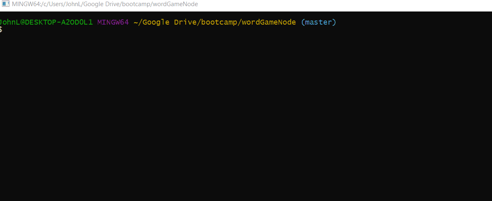
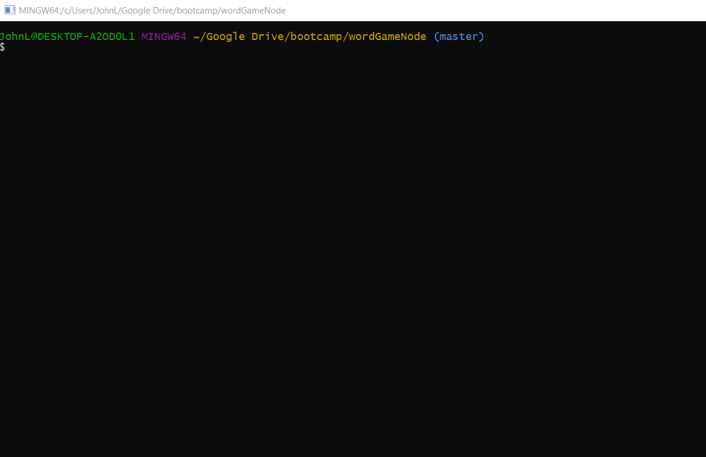

# wordGameNode results
Letter guessing game running on bash terminal using node.js

## Gifs showing running program
Gifs are running, cannot be stopped on click

#### Guessing a word letter by letter

#### Guessing a word

#### using control-c

